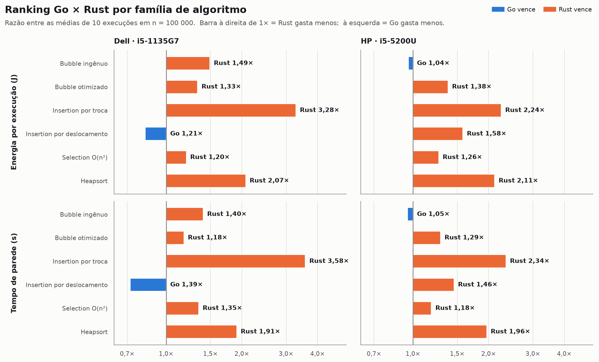
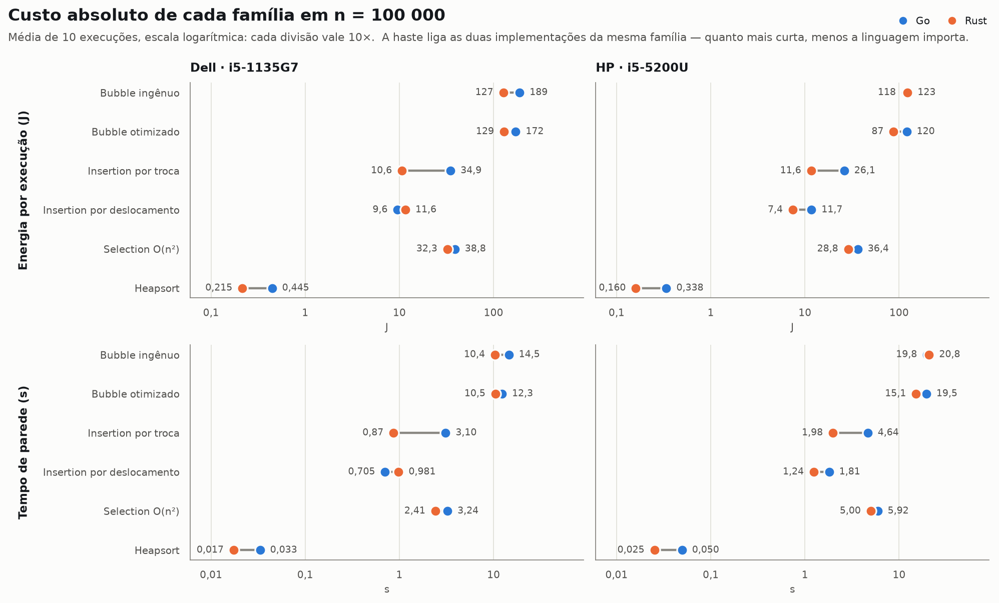
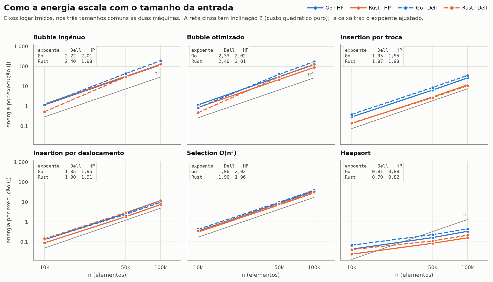
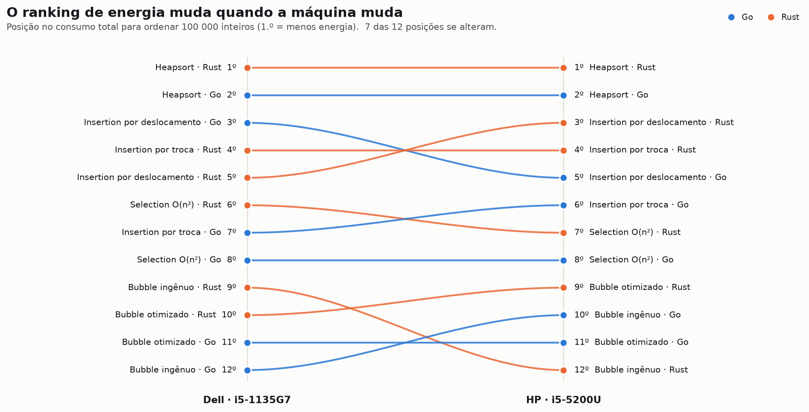
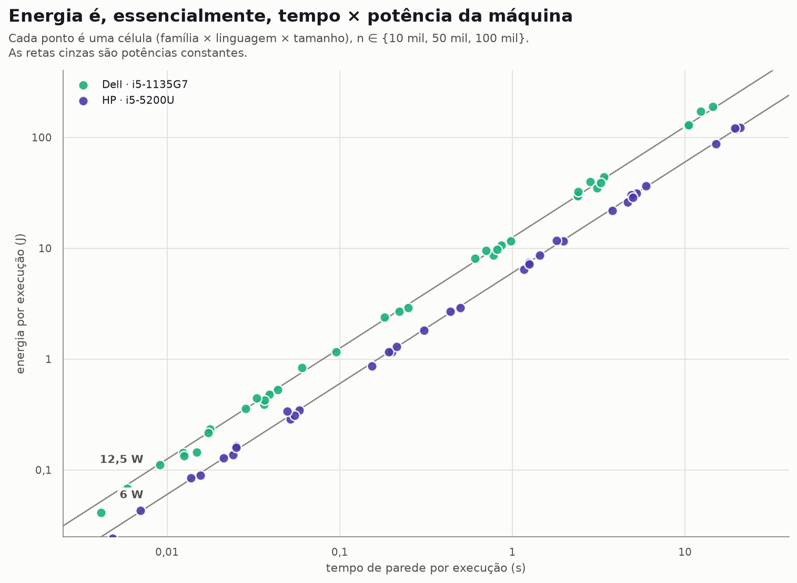

## 1. A pergunta

"Rust é mais eficiente que Go" é o tipo de afirmação que circula sem número
associado. Quando alguém tenta colocar número, costuma aparecer um segundo
problema: o número vale para aquela máquina, naquele dia, com aquele algoritmo — e
é apresentado como se valesse para a linguagem.

Este relatório ataca as duas coisas ao mesmo tempo. A pergunta de pesquisa é dupla:

1. **Dentro de um mesmo algoritmo**, quanta energia e quanto tempo separam a
   implementação em Go da implementação em Rust?
2. **Esse ranking é estável** quando a mesma bateria de medições roda em uma
   máquina de outra geração?

A segunda pergunta é a que raramente é feita, e é a que este material permite
responder: as duas medições usaram os mesmos scripts, os mesmos fontes e as mesmas
listas de entrada, em hardware separado por cinco anos de arquitetura Intel.

---

## 2. O que foi medido

Doze programas de linha de comando — seis em Go, seis em Rust. Cada um lê uma lista
de inteiros do `stdin`, ordena em memória e imprime o resultado. Nenhum usa a
ordenação da biblioteca padrão; todos implementam o algoritmo à mão, que é o ponto
do exercício.

### 2.1 O pareamento `v1`/`v2` não é confiável

Os programas são nomeados `v1` e `v2` em cada linguagem, e a tentação óbvia é
comparar `v1` com `v1`. **Isso produziria um resultado errado.** Lendo os fontes, o
que está nomeado como "selection" nas duas linguagens é, na prática, quatro
algoritmos diferentes distribuídos de forma cruzada:

- `go/go_algs/selection_v1.go` monta um *heap* com `container/heap` — é
  **heapsort**, Θ(n log n);
- `rust/rust_algs/selection_sort_v1.rs` é a **seleção clássica do mínimo**, Θ(n²);
- e as versões `v2` invertem os papéis.

O pareamento ingênuo devolveria, em n = 100 000, uma razão de **72,6× "a favor de
Go"** em `selection v1` e de **180,4× "a favor de Rust"** em `selection v2` no Dell.
Os dois números são reais e reprodutíveis, e nenhum deles diz coisa alguma sobre
linguagens: são diferenças de complexidade assintótica.

Reagrupamos, então, por **família semântica** — o que o código de fato faz, não o
que o arquivo se chama. As seis famílias abaixo são as unidades de comparação usadas
no resto do relatório.

| Família comparada | Fonte Go | O que faz | Fonte Rust | O que faz | Complexidade |
|:--|:--|:--|:--|:--|:--|
| Bubble ingênuo | `bubble_v1.go` | n passadas completas, sem parada antecipada | `bubble_sort_v1.rs` | idem | Θ(n²) nas duas |
| Bubble otimizado | `bubble_v2.go` | flag de troca + remoção do maior com `slices.Insert` | `bubble_sort_v2.rs` | limite superior recua até a última troca | Θ(n²); otimizações **diferentes** |
| Insertion por troca | `insert_v1.go` | `swap` a cada passo do laço interno | `insertion_sort_v1.rs` | idem | Θ(n²) nas duas |
| Insertion por deslocamento | `insert_v2.go` | guarda a chave e desloca | `insertion_sort_v2.rs` | idem | Θ(n²) nas duas |
| Selection O(n²) | `selection_`**`v2`**`.go` | `slices.Min` + `slices.Index` + `slices.Delete` | `selection_sort_`**`v1`**`.rs` | seleção clássica do mínimo | Θ(n²); **variantes cruzadas** |
| Heapsort | `selection_`**`v1`**`.go` | `container/heap` | `selection_sort_`**`v2`**`.rs` | *sift-down* manual | Θ(n log n); **variantes cruzadas** |

Note que *bubble otimizado* continua sendo uma comparação imperfeita: as duas
linguagens receberam otimizações **diferentes**. Em Rust, o limite do laço externo
recua até a última troca; em Go, além da *flag* de troca, o maior elemento é
transferido para um vetor de saída com `slices.Insert` na posição 0, o que custa
O(n) por remoção. Essa família mede "linguagem + decisão de otimização", não
linguagem isolada, e é assim que deve ser lida.

### 2.2 Entradas, e o recorte em n ≥ 10 000

Uma lista aleatória por tamanho, gerada uma única vez por
`geracoes_listas/geraEntrada.cpp` e reutilizada em todas as execuções, nas duas
máquinas. Isso elimina a variação de entrada entre execuções — mas também significa
que todo resultado aqui vale para **uma** permutação, não para o caso médio.

**Todas as comparações deste relatório usam listas de 10 000 elementos em diante.**
São duas razões, uma prática e uma metodológica: o Dell só foi medido a partir desse
tamanho, e abaixo dele o contador RAPL não tem resolução para enxergar a diferença —
a §3.4 mostra a evidência. Com o corte, o desenho fica **balanceado**: 12 programas ×
3 tamanhos × 10 repetições em *cada* máquina.

As 360 execuções menores do HP (n = 10 a 1 000) continuam no repositório e aparecem
uma única vez, na §3.4, como a medida do instrumento que justifica o corte. Elas não
entram em nenhuma comparação.

---

## 3. Metodologia

### 3.1 Instrumentação

Cada execução é envolvida por:

```bash
perf stat -x';' -a -e power/energy-pkg/,duration_time \
     /usr/bin/time -f '%U;%S' ./binario < lista.in
```

Três decisões importam aqui:

- **O modo *system-wide* (`-a`) não é opcional.** O contador `power/energy-pkg/`
  vem da PMU `power` (RAPL), que tem escopo de pacote, não de tarefa. Medir apenas
  o processo devolve `<not supported>`. A consequência é direta e inescapável:
  **os joules relatados são os do pacote inteiro durante a janela de execução**, não
  a energia marginal do algoritmo.
- **A compilação fica fora da janela.** Go via `go build`, Rust via
  `rustc -O -C debuginfo=0`, ambos antes de qualquer medição.
- **O tempo de CPU vem do GNU `time`**, e não do `perf`: com `-a`, os eventos
  `user_time`/`system_time` do `perf` somam a máquina inteira e não serviriam.

### 3.2 Repetições e estatística

Dez execuções por célula (família × linguagem × tamanho), em uma grade balanceada de
36 células por máquina — **720 execuções** comparáveis, somando
16,6 kJ (4,60 Wh) e 32,4 min sob medição. Nenhuma execução voltou sem
energia ou sem duração.

Reportamos média e desvio-padrão populacional. As razões entre linguagens trazem
intervalo de confiança de 95% por *bootstrap* (20 000 reamostragens com reposição) e
o *d* de Cohen como tamanho de efeito.

### 3.3 O que foi e o que não foi controlado

Seguindo a lista de *Zen mode* e *freeze your settings* do material do curso, vale
separar honestamente o que o experimento garante do que ele apenas espera:

- **Garantido:** mesma lista de entrada; mesmos fontes; mesmos scripts; compilação
  fora da janela; ordem fixa de execução; dez repetições por célula; grade completa.
- **Verificado a posteriori:** não há deriva ao longo das dez execuções. A razão
  entre a primeira execução e a média das nove seguintes é 0,995 nas duas máquinas,
  e a série normalizada oscila dentro de ±1%. A ausência de uma fase explícita de
  aquecimento não introduziu viés detectável.
- **Não controlado nem registrado:** brilho e resolução de tela, estado da rede,
  carga e presença da bateria, temperatura ambiente, *governor* de frequência no
  Dell, processos de segundo plano. Não houve pausa de resfriamento entre execuções.
- **Ausente:** nenhuma linha de base ociosa foi medida em nenhuma das máquinas. Essa
  é a lacuna metodológica mais séria do conjunto, e a §7 desenvolve por quê.

### 3.4 Por que o corte em n = 10 000

Esta é a única seção que olha para as execuções pequenas do HP. Elas não são um
resultado: são a medida do **instrumento**.

No HP, uma execução com n = 10 gasta **0,0186 J em 2,85 ms** — é o custo de
iniciar o processo e ler a entrada, e o RAPL reporta em passos de **0,01 J**. Em
n ≤ 1 000, os valores medidos assumem só quatro níveis distintos (0,01 · 0,02 · 0,03 ·
0,04 J) e o coeficiente de variação entre as dez repetições chega a 43%. Não há
sinal ali: há o passo do contador.

O efeito disso sobre uma conclusão é direto. Ajustando a inclinação log–log no HP
**com** n = 1 000 na amostra, as famílias quadráticas caem para ~1,8; ajustando só
de 10 000 em diante, sobem para ~2,0 — o valor que a teoria prevê. O primeiro ajuste
não estaria medindo o algoritmo, e sim o piso achatando a curva.

Daí o corte. Dentro do recorte a dispersão é aceitável: o coeficiente de variação
mediano da energia cai de 8,7% (Dell) e 3,1% (HP) em n = 10 000 para 1,2% e 0,5% em
n = 100 000.

Uma ressalva permanece **dentro** do recorte: o piso ainda representa **11,6%**
do total do heapsort em Rust em n = 100 000 (contra 0,016% do bubble ingênuo em Go).
**As cifras de heapsort são, portanto, um limite superior** do custo do algoritmo,
não sua medida.

---

## 4. As duas máquinas

| Item | Máquina A · Dell | Máquina B · HP |
|:--|:--|:--|
| Modelo | Dell Inspiron 15 3511 | HP (notebook consumer, Broadwell-U 2015) |
| CPU | Intel Core i5-1135G7 @ 2,40 GHz (Tiger Lake, 2020) | Intel Core i5-5200U @ 2,20 GHz (Broadwell, 2015) |
| Núcleos / threads | 4 / 8 | 2 / 4 |
| Cache L3 | 8 MiB | 3 MiB |
| Memória | 8 GiB DDR4-3200 | 11 GiB |
| Sistema | Linux (`lshw`); distribuição e kernel não registrados | Debian 12 *bookworm*, kernel 6.1.0-52-amd64 |
| Governor / turbo | não registrado | `intel_cpufreq`, `schedutil`, 0,5–2,7 GHz, turbo ativo |
| Toolchain | não registrado | rustc/cargo 1.94.0; versão do Go não registrada |
| Domínios RAPL lidos | `pkg` | `pkg`, `cores`, `dram` |
| Potência média do pacote (n ≥ 10 000) | ≈ 12,3 W | ≈ 5,9 W |
| Tamanhos comparados | 10 000 · 50 000 · 100 000 | 10 000 · 50 000 · 100 000 |
| Execuções comparáveis | 360 (12 programas × 3 tamanhos × 10) | 360 (12 programas × 3 tamanhos × 10) |
| Execuções extras, fora do recorte | — | 360 (n = 10 · 100 · 1 000), usadas só na §3.4 |

As lacunas marcadas como "não registrado" são reais: o arquivo de *specs* do Dell é
uma saída de `lshw`, que descreve hardware e não diz nada sobre distribuição,
kernel, *governor* ou versões de compilador. O arquivo do HP é muito mais completo,
mas registra `go: não instalado` — apesar das 360 execuções de binários Go medidas
nessa máquina. A versão do Go usada no HP, portanto, é desconhecida.

---

## 5. Resultados

Toda a leitura abaixo usa n = 100 000, o maior tamanho comum às duas máquinas,
exceto onde indicado.

### 5.1 Rust vence quase sempre — mas não as mesmas famílias em cada máquina



| Família                    | Máquina          | Go (J)   | Rust (J)   | Razão Go÷Rust   | IC 95%       | *d* de Cohen   | Vencedor       |
|:---------------------------|:-----------------|:---------|:-----------|:----------------|:-------------|:---------------|:---------------|
| Bubble ingênuo             | Dell · i5-1135G7 | 189      | 127        | 1,49            | [1,47; 1,51] | 24,9           | **Rust** 1,49× |
| Bubble otimizado           | Dell · i5-1135G7 | 172      | 129        | 1,33            | [1,32; 1,35] | 19,2           | **Rust** 1,33× |
| Insertion por troca        | Dell · i5-1135G7 | 34,9     | 10,6       | 3,28            | [3,25; 3,30] | 80,8           | **Rust** 3,28× |
| Insertion por deslocamento | Dell · i5-1135G7 | 9,57     | 11,6       | 0,83            | [0,82; 0,83] | -20,0          | **Go** 1,21×   |
| Selection O(n²)            | Dell · i5-1135G7 | 38,8     | 32,3       | 1,20            | [1,19; 1,21] | 15,4           | **Rust** 1,20× |
| Heapsort                   | Dell · i5-1135G7 | 0,445    | 0,215      | 2,07            | [2,00; 2,15] | 13,6           | **Rust** 2,07× |
| Bubble ingênuo             | HP · i5-5200U    | 118      | 123        | 0,96            | [0,94; 0,97] | -2,5           | **Go** 1,04×   |
| Bubble otimizado           | HP · i5-5200U    | 120      | 87,4       | 1,38            | [1,37; 1,38] | 83,2           | **Rust** 1,38× |
| Insertion por troca        | HP · i5-5200U    | 26,1     | 11,6       | 2,24            | [2,23; 2,25] | 144,9          | **Rust** 2,24× |
| Insertion por deslocamento | HP · i5-5200U    | 11,7     | 7,43       | 1,58            | [1,56; 1,60] | 32,6           | **Rust** 1,58× |
| Selection O(n²)            | HP · i5-5200U    | 36,4     | 28,8       | 1,26            | [1,26; 1,27] | 41,3           | **Rust** 1,26× |
| Heapsort                   | HP · i5-5200U    | 0,338    | 0,160      | 2,11            | [2,05; 2,19] | 13,7           | **Rust** 2,11× |

**Rust venceu 5 das 6 famílias em cada máquina.** Onde vence, o faz por fatores
entre 1,20× e 3,28× em energia. Todas as diferenças são estatisticamente sólidas:
nenhum intervalo de confiança contém 1,00, e vários efeitos de Cohen passam de
*d* = 20.

O placar idêntico esconde o resultado mais interessante: **duas famílias invertem o
sinal entre as máquinas**, e são justamente elas que decidem o 6.º lugar de cada
placar:

| Família | Dell · i5-1135G7 | HP · i5-5200U |
|:--|:--|:--|
| Bubble ingênuo | **Rust** 1,49× | **Go** 1,04× |
| Insertion por deslocamento | **Go** 1,21× | **Rust** 1,58× |

O sentido de cada inversão se mantém nos três tamanhos comuns — no *bubble* ingênuo,
Rust vai de 2,20× a 1,49× no Dell enquanto Go fica entre 1,12× e 1,04× no HP. A
única célula frágil é o *insertion* por deslocamento no Dell em n = 10 000, onde a
vantagem de Go (1,08×) cai dentro do intervalo de confiança; nos outros dois
tamanhos ela é de 1,21× a 1,22× e sólida.

A leitura correta, portanto, não é "Rust é 2× melhor". É: **a vantagem de Rust
existe na maioria dos casos, varia de empate a 3,3× conforme o algoritmo, e pode
mudar de sinal quando a máquina muda.**

### 5.2 O algoritmo domina tudo



Entre a melhor e a pior configuração medida há um fator de **880× em
energia** no Dell (0,215 J para heapsort em Rust contra 189,1 J para
bubble ingênuo em Go) e de **769×** no HP. Nenhuma diferença entre
linguagens chega perto disso: a maior que medimos é 3,28×. **O algoritmo tem cerca
de 268× mais alcance que a linguagem** no Dell e 343× no HP.

Repare também no comprimento das hastes da figura. Em *selection* O(n²) e em
*bubble* ingênuo, os dois pontos quase se tocam — ali a linguagem quase não importa,
porque o custo é dominado por comparações e trocas em um laço simples que os dois
compiladores resolvem de forma parecida. Em *insertion* por troca a haste é longa: o
padrão de `swap` a cada passo é exatamente o tipo de código em que a diferença de
geração de código aparece.

### 5.3 A escala confirma a complexidade — exceto onde o piso atrapalha



Inclinação da reta log–log da **energia** contra *n*, ajustada sobre os três
tamanhos do recorte. 2,0 = custo quadrático; 1,0 = linear.

| Família                    | Dell · Go   | Dell · Rust   | HP · Go   | HP · Rust   |
|:---------------------------|:------------|:--------------|:----------|:------------|
| Bubble ingênuo             | 2,22        | 2,40          | 2,01      | 1,98        |
| Bubble otimizado           | 2,33        | 2,46          | 2,02      | 2,01        |
| Insertion por troca        | 1,95        | 1,87          | 1,95      | 1,93        |
| Insertion por deslocamento | 1,85        | 1,90          | 1,95      | 1,91        |
| Selection O(n²)            | 1,96        | 1,96          | 2,02      | 1,96        |
| Heapsort                   | 0,81        | 0,70          | 0,88      | 0,82        |

No HP, as cinco famílias quadráticas ficam em **1,91 a 2,02** — a
teoria aparece limpa nos dados. O Dell, com janelas muito mais curtas e portanto
mais sensível ao custo fixo de iniciar o processo, fica mais disperso
(1,85 a 2,46).

O heapsort marca 0,70 a 0,88, bem abaixo do ~1,05 esperado de
n log n. Não é uma propriedade do algoritmo: é a assinatura do piso descrito na
§3.4, que responde por 11,6% do total naquelas células. O mesmo ajuste sobre o
tempo, em vez da energia, dá praticamente os mesmos números — a conclusão não
depende da métrica escolhida.

Com três pontos, o ajuste é curto: serve para separar Θ(n²) de Θ(n log n), não para
estimar a constante com precisão.

### 5.4 O ranking não sobrevive à troca de máquina



| Implementação                     | Dell · pos.   | Dell · energia (J)   | HP · pos.   | HP · energia (J)   | Δ   |
|:----------------------------------|:--------------|:---------------------|:------------|:-------------------|:----|
| Heapsort · Rust                   | 1º            | 0,215                | 1º          | 0,160              | =   |
| Heapsort · Go                     | 2º            | 0,445                | 2º          | 0,338              | =   |
| Insertion por deslocamento · Go   | 3º            | 9,57                 | 5º          | 11,7               | ▼ 2 |
| Insertion por troca · Rust        | 4º            | 10,6                 | 4º          | 11,6               | =   |
| Insertion por deslocamento · Rust | 5º            | 11,6                 | 3º          | 7,43               | ▲ 2 |
| Selection O(n²) · Rust            | 6º            | 32,3                 | 7º          | 28,8               | ▼ 1 |
| Insertion por troca · Go          | 7º            | 34,9                 | 6º          | 26,1               | ▲ 1 |
| Selection O(n²) · Go              | 8º            | 38,8                 | 8º          | 36,4               | =   |
| Bubble ingênuo · Rust             | 9º            | 127                  | 12º         | 123                | ▼ 3 |
| Bubble otimizado · Rust           | 10º           | 129                  | 9º          | 87,4               | ▲ 1 |
| Bubble otimizado · Go             | 11º           | 172                  | 11º         | 120                | =   |
| Bubble ingênuo · Go               | 12º           | 189                  | 10º         | 118                | ▲ 2 |

Esta é a resposta à segunda pergunta de pesquisa. O topo é estável — heapsort em
Rust e depois em Go ocupam o 1.º e o 2.º lugar nas duas máquinas, com margem enorme.
Daí para baixo, **7 das 12 posições se alteram**, com cruzamentos que não
são sutis:

- *Bubble ingênuo em Rust* despenca da 9.ª posição no Dell para a **12.ª** no HP,
  enquanto a versão em Go sobe da 12.ª para a 10.ª. As duas trocam de lado.
- *Insertion por deslocamento* troca as duas linguagens de posição: Go era 3.º e
  Rust 5.º no Dell; no HP, Rust é 3.º e Go é 5.º.

Um relatório que tivesse medido só o Dell concluiria que Go vence no *insertion* por
deslocamento. Um que tivesse medido só o HP concluiria o contrário. As duas
conclusões estariam corretas — sobre uma máquina cada.

### 5.5 Mais rápido não é mais verde



Os pontos caem sobre duas retas de inclinação 1, uma por máquina. Isso é o esperado
quando a potência do pacote pouco varia: **E ≈ P × t**, com P ≈ 12,3 W no Dell e
P ≈ 5,9 W no HP. É a razão pela qual, neste experimento, o ranking de energia é
quase idêntico ao de tempo.

Duas consequências importam. A primeira é que **o que medimos é energia-até-concluir
da máquina inteira** — uma métrica legítima, é o que uma fatura de energia cobra,
mas que não é a energia marginal do algoritmo.

A segunda aparece ao comparar as faixas. **O Dell é mais rápido nas 12
implementações** (de 1,27× a 2,57×) e ainda assim **gasta mais joules em 10 delas**.
No caso extremo, executa bubble ingênuo em Go 1,36× mais rápido e gasta 1,60× mais
energia para fazê-lo. A potência da plataforma pode anular o ganho de tempo — e aqui
anula com sobra.

### 5.6 Go puxa alguns pontos percentuais a mais de potência

| Máquina          | Go      | Rust    | Diferença   |
|:-----------------|:--------|:--------|:------------|
| Dell · i5-1135G7 | 12,56 W | 12,10 W | **+3,8 %**  |
| HP · i5-5200U    | 6,06 W  | 5,80 W  | **+4,4 %**  |

Recorte: todas as células com n ≥ 10 000. A diferença é pequena mas consistente nas
duas máquinas, compatível com o *runtime* de Go manter *threads* e coletor de lixo
ativos ao lado do laço de ordenação. Como a potência entra multiplicando o tempo,
essa diferença se soma à diferença de tempo em vez de compensá-la — o que explica por
que as razões de energia são em geral um pouco maiores que as razões de tempo.

A repartição dos domínios RAPL no HP (o único que os registrou separadamente) é
estável em todas as implementações: cerca de 72% em `cores`, 19% em `dram` e 9% no
resto do pacote. Nenhuma delas é mais intensiva em memória que as outras de forma
relevante.

### 5.7 Tabela completa

| Família                    | Ling.   | Dell · E (J)    | Dell · t (s)     | Dell · P (W)   | Dell · µJ/el.   | HP · E (J)      | HP · t (s)       | HP · P (W)   | HP · µJ/el.   |
|:---------------------------|:--------|:----------------|:-----------------|:---------------|:----------------|:----------------|:-----------------|:-------------|:--------------|
| Bubble ingênuo             | Go      | 189,121 ± 3,162 | 14,5246 ± 0,0486 | 13,02          | 1 891,21        | 117,931 ± 0,323 | 19,7987 ± 0,0115 | 5,96         | 1 179,31      |
|                            | Rust    | 126,858 ± 1,568 | 10,3561 ± 0,0156 | 12,25          | 1 268,58        | 123,009 ± 2,890 | 20,8301 ± 0,1295 | 5,90         | 1 230,09      |
| Bubble otimizado           | Go      | 171,855 ± 2,872 | 12,2964 ± 0,0546 | 13,98          | 1 718,55        | 120,465 ± 0,410 | 19,4667 ± 0,0108 | 6,19         | 1 204,65      |
|                            | Rust    | 129,005 ± 1,291 | 10,4622 ± 0,0260 | 12,33          | 1 290,05        | 87,376 ± 0,385  | 15,1237 ± 0,0099 | 5,78         | 873,76        |
| Insertion por troca        | Go      | 34,918 ± 0,423  | 3,0967 ± 0,0013  | 11,28          | 349,18          | 26,130 ± 0,120  | 4,6401 ± 0,0040  | 5,63         | 261,30        |
|                            | Rust    | 10,649 ± 0,038  | 0,8659 ± 0,0007  | 12,30          | 106,49          | 11,645 ± 0,074  | 1,9803 ± 0,0020  | 5,88         | 116,45        |
| Insertion por deslocamento | Go      | 9,569 ± 0,085   | 0,7050 ± 0,0006  | 13,57          | 95,69           | 11,730 ± 0,180  | 1,8085 ± 0,0079  | 6,49         | 117,30        |
|                            | Rust    | 11,584 ± 0,114  | 0,9809 ± 0,0011  | 11,81          | 115,84          | 7,428 ± 0,049   | 1,2425 ± 0,0042  | 5,98         | 74,28         |
| Selection O(n²)            | Go      | 38,796 ± 0,450  | 3,2413 ± 0,0021  | 11,97          | 387,96          | 36,374 ± 0,131  | 5,9206 ± 0,0053  | 6,14         | 363,74        |
|                            | Rust    | 32,299 ± 0,392  | 2,4081 ± 0,0007  | 13,41          | 322,99          | 28,759 ± 0,226  | 5,0024 ± 0,0110  | 5,75         | 287,59        |
| Heapsort                   | Go      | 0,445 ± 0,023   | 0,0332 ± 0,0015  | 13,46          | 4,45            | 0,338 ± 0,018   | 0,0496 ± 0,0017  | 6,82         | 3,38          |
|                            | Rust    | 0,215 ± 0,007   | 0,0174 ± 0,0009  | 12,38          | 2,15            | 0,160 ± 0,000   | 0,0252 ± 0,0003  | 6,34         | 1,60          |

Os tamanhos 50 000 e 10 000, o coeficiente de variação por célula e as razões em
tempo estão no [notebook de análise](https://github.com/gmourafilho94/GoxRust_energy/blob/main/analise/analise.ipynb).

---

## 6. Tamanho de efeito prático

Quase todas as diferenças são estatisticamente sólidas. Isso, porém, diz pouco sobre
se a diferença **importa**. Vale traduzir os dois tipos de decisão em uma unidade que
alguém consiga usar: um serviço que ordene um milhão de listas de 100 000 inteiros
por dia.

| Decisão | Ganho por execução | Ganho por dia |
|:--|--:|--:|
| **Trocar de algoritmo** (bubble ingênuo em Go → heapsort em Rust) | 188,91 J | **52,47 kWh** |
| **Trocar só de linguagem** (heapsort em Go → heapsort em Rust) | 0,230 J | **0,064 kWh** |

A primeira decisão tem **821× a alavancagem** da segunda no Dell, e
690× no HP. E a comparação é generosa com a linguagem: heapsort é justamente
onde a vantagem relativa de Rust é maior (2,07×). Se o algoritmo já é bom, o ganho
absoluto de reescrevê-lo em outra linguagem é pequeno; se o algoritmo é ruim, nenhuma
linguagem salva.

> **Para quem escreve código, não artigo.** A conclusão aplicável não é "use Rust".
> É: gaste seu orçamento de atenção onde a escala do efeito está. Antes de discutir
> linguagem, verifique a complexidade do que está no laço quente — foi o que separou
> 0,2 J de 189 J aqui. Depois disso, a escolha de linguagem vale entre 4% e 230% em
> cima do que sobrou, dependendo do algoritmo e da máquina, e você precisa medir na
> sua máquina para saber qual.

---

## 7. Ameaças à validade

Em ordem de gravidade.

1. **Não há linha de base ociosa.** Como `perf -a` mede o pacote inteiro, cada número
   inclui o consumo de fundo da máquina durante a janela. Sem uma medição de repouso,
   não é possível separar "energia do algoritmo" de "energia da máquina ligada
   enquanto o algoritmo roda". É o que torna E ≈ P × t quase exato (§5.5) e o que
   infla a vantagem aparente de qualquer código mais rápido.
   *Correção para um próximo ciclo:* medir 60 s de repouso antes de cada bloco e
   reportar também a energia líquida.
2. **O piso do instrumento ainda afeta o heapsort.** Resolução de 0,01 J e 0,0186 J
   de custo fixo por execução já motivaram descartar n ≤ 1 000 (§3.4), mas ainda
   embutem 11,6% de sobrecarga nos números de heapsort em n = 100 000.
   *Correção:* ordenar em laço dentro do processo, amortizando a inicialização, ou
   subir os tamanhos.
3. **A janela inclui E/S e *parsing*.** Toda execução lê a lista do `stdin` e imprime
   a saída ordenada, e esse custo O(n) está dentro da medição. Para os algoritmos
   quadráticos ele é desprezível; para o heapsort, não é.
4. **"Bubble otimizado" compara otimizações diferentes.** Documentado na §2.1. A
   família mede linguagem *e* decisão de implementação juntas.
5. **Os ambientes não estão equiparados nem totalmente documentados.** Distribuição,
   kernel, *governor* e toolchain do Dell não foram registrados; a versão do Go no HP
   é desconhecida. Parte da diferença entre máquinas pode vir de versão de
   compilador, não de hardware.
6. **Uma única entrada por tamanho.** Todos os resultados valem para uma permutação
   aleatória fixa. Entradas já ordenadas ou invertidas mudariam drasticamente as
   famílias com parada antecipada.
7. **Apenas três tamanhos.** O recorte em n ≥ 10 000 deixa três pontos por curva
   para ajustar cada expoente — o bastante para distinguir Θ(n²) de Θ(n log n),
   pouco para estimar a constante. Uma bateria futura ganharia mais com tamanhos
   intermediários (20 mil, 200 mil) do que com repetições adicionais.
8. **Duas máquinas não são uma amostra.** Mostramos que o ranking *pode* mudar com a
   plataforma; não estimamos com que frequência isso acontece.
9. **Sem *Zen mode* documentado.** Brilho, rede, bateria e processos de fundo não
   foram fixados nem registrados. A ausência de deriva ao longo das dez execuções
   (§3.3) sugere que o efeito foi pequeno, mas isso é evidência indireta.

---

## 8. Conclusões

1. **Rust foi mais eficiente na maioria dos casos, com magnitude muito variável.**
   Cinco das seis famílias em cada máquina, por fatores de 1,20× a 3,28× em energia.
   Mas não as mesmas cinco: o placar idêntico esconde duas inversões. A vantagem não
   é uma constante da linguagem — é uma função do algoritmo e da plataforma.
2. **O ranking depende da máquina.** 7 das doze posições mudam entre as
   plataformas, e duas famílias — bubble ingênuo e insertion por deslocamento —
   invertem o sinal do resultado. Qualquer *benchmark* de linguagem em uma só máquina
   está reportando uma propriedade do par linguagem-máquina.
3. **Mais rápido não é mais verde entre plataformas.** O Dell é 1,3× a 2,6× mais
   rápido que o HP em todas as implementações e, em 10 de 12, gasta mais joules para
   o mesmo trabalho, porque sustenta o dobro da potência de pacote.
4. **A alavancagem está no algoritmo, por quase três ordens de grandeza.**
   880× entre a melhor e a pior configuração, contra no máximo 3,28× entre
   linguagens.
5. **Go sustenta consistentemente uma potência de pacote maior** — +3,8% no Dell,
   +4,4% no HP — o que soma à diferença de tempo em vez de compensá-la.
6. **Ler o código antes de parear salvou o resultado.** O descasamento `v1`/`v2` em
   *selection* teria produzido uma razão de 72,6× "a favor de Go" que seria pura
   diferença de complexidade assintótica. Em um estudo comparativo, conferir que os
   dois lados implementam o mesmo algoritmo não é formalidade.

---

## 9. Replicação

Todo o material está em
[github.com/gmourafilho94/GoxRust_energy](https://github.com/gmourafilho94/GoxRust_energy):
os programas medidos, os scripts que rodam a bateria sob `perf`, os dois CSV
consolidados e o notebook que produz cada número e cada figura deste relatório.

```bash
# refazer a análise a partir dos CSV
jupyter lab analise/analise.ipynb        # e Run All

# refazer a bateria em uma terceira máquina
scripts/implementacao.sh -r 10 -t "10000 50000 100000"
scripts/medicao.sh saida.csv
```

É preciso `perf` com acesso a `power/energy-pkg/` — ou seja,
`perf_event_paranoid ≤ 0` ou privilégio de *root*.

---

## 10. Fontes

1. Cruz, L. *Green Software Engineering Done Right: a Scientific Guide to Set Up
   Energy Efficiency Experiments.* Material do curso Sustainable Software
   Engineering, TU Delft.
   <https://luiscruz.github.io/course_sustainableSE/2026/p1_measuring_software/>
2. Documentação do `perf stat` e da PMU `power` (Intel RAPL) no kernel Linux:
   `tools/perf/Documentation/perf-stat.txt`.
3. Pereira, R. *et al.* "Energy Efficiency across Programming Languages."
   *SLE 2017* — referência clássica para o formato da comparação, e um bom
   contraponto: também reporta resultados de uma máquina única.
4. Khan, K. N. *et al.* "RAPL in Action: Experiences in Using RAPL for Power
   Measurements." *ACM ToMPECS*, 2018 — sobre a precisão e os limites do contador
   usado aqui.
